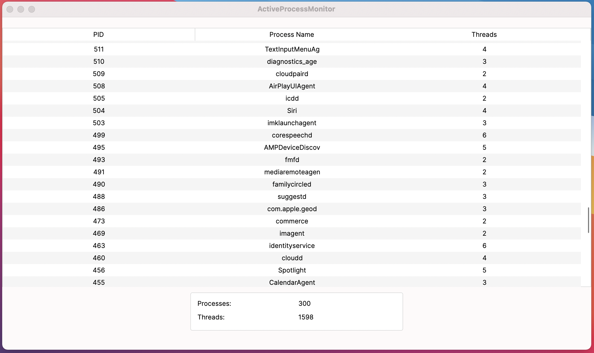
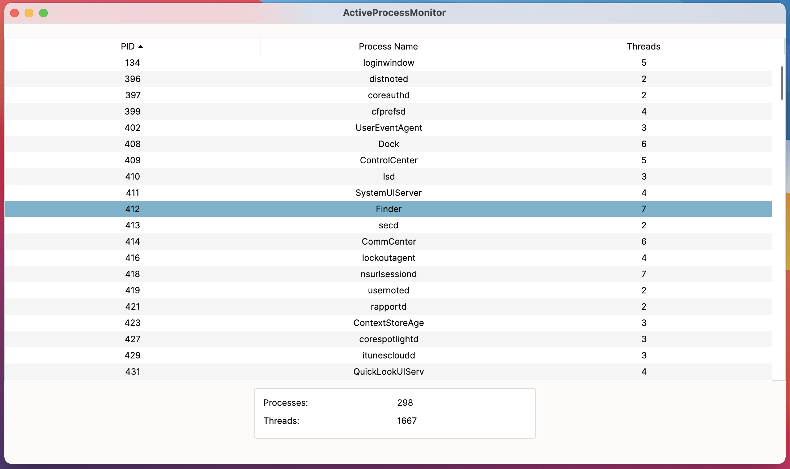

# ActiveProcessMonitor

Displays the current running processes on your local computer.

*Read this in other languages: [Русский](README.ru-RU.md)*

  
Table of Contents

  <ol>
    <li>
      <a href="#about-the-project">About The Project</a>
      <ul>
        <li><a href="#implemented-functionality">Implemented Functionality</a></li>
        <li><a href="#built-with">Built With</a></li>
        <li><a href="#structure">Structure</a></li>
      </ul>
    </li>
    <li><a href="#usage">Usage</a></li>
  </ol>

## About The Project

Technical requirement for the project:

**Make a desktop app "process manager" using C#, which consists of two parts:**

* UI application (WPF, Windows Forms, Avalonia, ..), which displays the list of currently running processes. This very app shouldn't calculate this list, it has to run another app (service) and read the data from it.
* Service (headless cosole application) which starts from the main process and constantly monitoring the list of active processes in the system. Whenever the list changes, service has to send the data  to the main app so it can change the UI.

For interprocess comunication could be used: stdout, text file, named pipes, protobuf, ..

### Implemented Functionality

Avalonia is used for UI so the app is cross-platform. 
Named pipes are used for interprocess communication.

The program imitates Activity Monitor (OS X) - dynamically updates data grid with processes.

* Service doesn't send the whole list of processes, only changes - so it doesn't require a lot of reading/writing to/from the pipe.
* ObservableCollectionsEx (From dynamic binding) is used for displaying data, so the view captures list changes without extra code.
* All the info about processes is accessed through the System.Diagnostics.Process.GetProcesses().

### Built With

Packages used:
* [AvaloniaUI](https://github.com/AvaloniaUI/Avalonia) For making a UI

### Structure

The solution includes two projects: one for UI (ActiveProcessMonitor), another is a service app (ProcessObserver).
For interprocess communication NamedPipeClientStream and NamedPipeServerStream from System.IO.Pipes is used in PipeServer and PipeClient static classes respectively. They are responcible for exchanging data - UI will not run until the pipe is connected from both sides.

## Usage

Some screenshots of the UI appearance:

